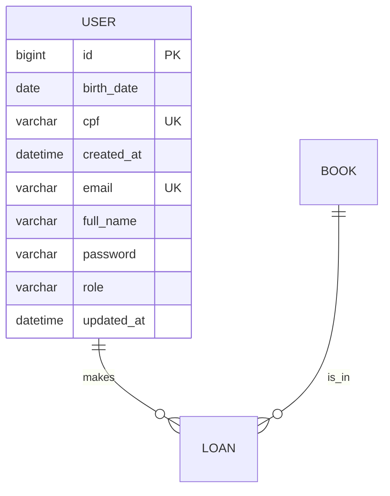

<p align="center">
  
  
  

  
</p>
<h1 align="center">📖 Gerenciador de Bibliotecas 📚</h1>

## ℹ️ Sobre o Projeto

Este projeto consiste em uma API REST desenvolvida com **Spring Boot** para o gerenciamento de bibliotecas. O sistema administra desde o cadastro de usuários e livros até as lógicas de empréstimo de livros.

> **🛡️ Aviso sobre privacidade:** Este projeto foi desenvolvido para fins educacionais. Os dados utilizados (como CPFs, e-mails e senhas) são fictícios, não representando informações de pessoas reais.

⚠️ O sistema ainda está em fase de desenvolvimento.

## 🔨 Roadmap de Desenvolvimento

### Geral
- [x] Configuração inicial do projeto (Spring initializr, dependências)
- [ ] Finalizar Entidade User
- [ ] Finalizar Entidade Book
- [ ] Finalizar Entidade Loan
- [ ] Documentação com Swagger

### 🧑 Entidade User (Usuário)
- [x] Criação da Entidade
- [x] CRUD completo (Criar, Consultar, Atualizar e Excluir)
- [x] Adicionar Autenticação com Spring Security
- [x] Adicionar Criptografia de senhas
- [ ] Testes unitários

### 📚 Entidade Book (Livro)
- [ ] Criação da Entidade
- [ ] CRUD completo (Criar, Consultar, Atualizar e Excluir)
- [ ] Testes unitários

### 🤝 Entidade Loan (Empréstimo)
- [ ] Criação da Entidade e os seus relacionamentos
- [ ] Fluxo de Empréstimos (Registrar, Consultar, Renovar, Finalizar)
- [ ] Testes unitários


### 🗃️ Arquitetura do banco de dados


(Esta seção será atualizada conforme o desenvolvimento da API)

### 📂 Estrutura do Projeto
```
.
├── src/
│   ├── main/
│   │   ├── java/
│   │   │   └── librarymanager/
│   │   │       ├── config/                             # Classes de configurações 
│   │   │       ├── controller/                         # Endpoints da API
│   │   │       ├── domain/                             # Entidades JPA e Enumerações
│   │   │       ├── dto/                                # Objetos de transferência de dados
│   │   │       ├── exception/                          # Exceções e GlobalHandlerException
│   │   │       ├── mapper/                             # Mappers
│   │   │       ├── repository/                         # Comunicação com o banco de dados
│   │   │       ├── security/                           # Configurações e camadas de segurança da API
│   │   │       ├── service/                            # Regras de negócio do sistema
│   │   │       └── LibraryManagerApiApplication.java   # Inicialização da Aplicação
│   │   └── resources/                                  # Perfis de ambiente e chaves de segurança RSA
│   └── test                                            # Testes unitários
├── compose.yaml                                        # Organização dos containers
├── Dockerfile                                          # Criação da imagem da API
├── pom.xml                                             # Dependências do projeto
├── .dockerignore                                       # Exclusão de arquivos desnecessários na imagem Docker 
├── .envTemplate                                        # Template das variáveis de ambiente
├── .gitignore 
└── README.md
```

(Esta seção será atualizada conforme o desenvolvimento da API)

### 🛠️ Tecnologias e ferramentas

**Linguagem:** Java 21

**Framework:** Spring Boot 3

**Persistência:** Spring Data JPA / Hibernate

**Banco de dados:** MySQL 8

**Infraestrutura:** Docker & Docker Compose

**Padrão de Camadas:** Arquitetura em camadas (Controller, Service, Repository e Entity)

## 🚀 Executando a Aplicação


(Esta seção será atualizada com o passo a passo para utilizar a API)
