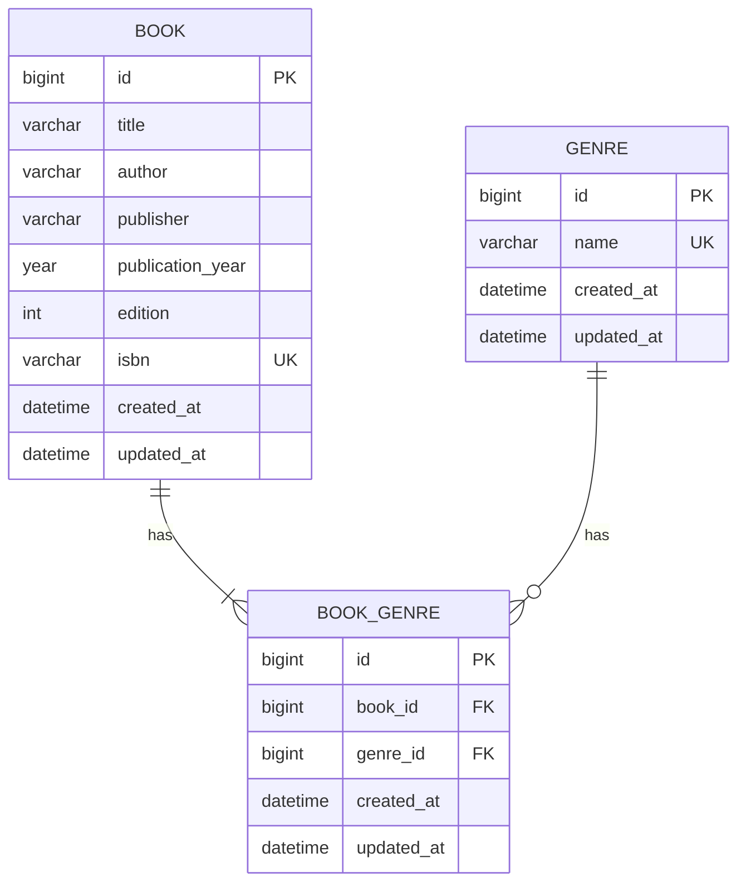
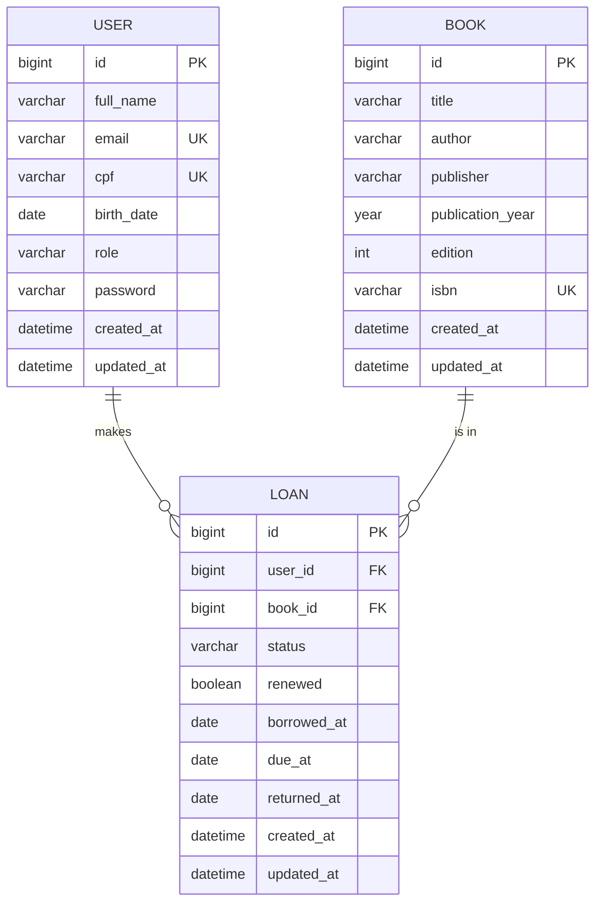

<p align="center">
  
  
  

  
</p>
<h1 align="center">📖 Gerenciador de Bibliotecas 📚</h1>

## ℹ️ Sobre o Projeto

Este projeto consiste em uma API REST desenvolvida com **Spring Boot** para o gerenciamento de bibliotecas. O sistema administra desde o cadastro de usuários e livros até as regras de negócios para gerenciamento dos empréstimos, contando com uma documentação interativa e segurança baseada em tokens criptografados. 

### 🚨 Avisos Importantes
> **🛡️ Privacidade:** Este projeto foi desenvolvido para fins educacionais. Os dados utilizados (como CPFs, e-mails e senhas) são fictícios, não representando informações de pessoas reais.

> **🔒 Segurança:** Este projeto utiliza o algoritmo **RSA** para a assinatura de tokens **JWT**. Para fins de demonstração, as chaves (públicas e privadas) estão inclusas no repositório. Em um cenário de produção real, gere novas chaves e jamais exponha sua chave privada.

---

## 📌 Sumário

- [💼 Regras de negócio](#-regras-de-negócio)
- [🗃️ Arquitetura do banco de dados](#-arquitetura-do-banco-de-dados)
- [📂 Estrutura do projeto](#-estrutura-do-projeto)
- [🛠️ Tecnologias e ferramentas](#-tecnologias-e-ferramentas)
- [🚀 Executando a aplicação](#-executando-a-aplicação)
- [📜 Monitoramento de logs](#-monitoramento-de-logs)
- [🧪 Testes unitários](#-testes-unitários)

---

## 💼 Regras de Negócio
Para simular o funcionamento de uma biblioteca real, o sistema aplica regras de negócio e validações para garantir a integridade dos dados. Os principais módulos são:

### 🧑 Autenticação e Usuários

- **Controle de acesso:** Autenticação via **JWT** com dois níveis de permissão:
    
    - `USER`: Perfil voltado para os leitores e clientes da biblioteca. Pode consultar o acervo, atualizar o seu próprio cadastro e visualizar o seu histórico de empréstimos.

    - `ADMIN`: Perfil voltado para os bibliotecários e administradores do sistema. Possui controle total do sistema (CRUD de livros, gêneros, usuários e auditoria de empréstimos).
  
- **Segurança dos dados:** As senhas são criptografadas com **BCrypt** antes de serem persistidas no banco de dados.
- **Dados únicos:** Cada usuário deve possuir um e-mail e CPF únicos no sistema, impedindo cadastros duplicados.
- **Proteção aos cargos:** Um usuário com o cargo USER não pode atualizar o seu próprio cargo para ADMIN, protegendo o sistema de invasões.

### 📚 Gerenciamento do Acervo

- **Identificação Única:** O cadastro de livros exige um código **ISBN** único no banco de dados.
- **Associação de gêneros:** Um livro pode ter múltiplos gêneros literários associados.
- **Cadastro de gêneros:** Os nomes dos gêneros são únicos, não sendo permitido o cadastro de gêneros com o mesmo nome.

### 🤝 Fluxo de empréstimos

- **Novo empréstimo:** Um empréstimo só pode ser criado se o livro estiver disponível e o usuário não possuir nenhum outro empréstimo ativo.
- **Renovação de empréstimo:** Um empréstimo tem duração de 14 dias, podendo ser renovado por mais 14 dias apenas uma vez.
- **Devolução de livros:** Antes de marcar um empréstimo como finalizado, o sistema deve garantir que o empréstimo existe e está ativo (são considerados status ativos: `BORROWED`, `RENEWED`, `OVERDUE`).
- **Data de retorno:** A data do retorno do empréstimo deve ser posterior à data de empréstimo.
- **Empréstimos vencidos:** Após iniciar o sistema e a cada 1 hora, o sistema verifica automaticamente no banco de dados se existem empréstimos que passaram da data de vencimento, e atualiza o seu status.

---

## 🗃️ Arquitetura do banco de dados
### Diagrama de Definição dos livros

```mermaid
erDiagram
    BOOK ||--|{ BOOK_GENRE : "has"
    GENRE ||--o{ BOOK_GENRE : "has"

BOOK {
    bigint id PK
    varchar title
    varchar author
    varchar publisher
    year publication_year
    int edition
    varchar isbn UK
    datetime created_at
    datetime updated_at
}

GENRE {
    bigint id PK
    varchar name UK
    datetime created_at
    datetime updated_at
}

BOOK_GENRE{
    bigint id PK
    bigint book_id FK
    bigint genre_id FK
    datetime created_at
    datetime updated_at
}
```

### Diagrama do Fluxo de Empréstimos

```mermaid
erDiagram
    USER ||--o{ LOAN : "makes"
    BOOK ||--o{ LOAN : "is in"

    USER {
        bigint id PK
        varchar full_name
        varchar email UK
        varchar cpf UK
        date birth_date
        varchar role
        varchar password
        datetime created_at
        datetime updated_at
    }

    BOOK {
        bigint id PK
        varchar title
        varchar author
        varchar publisher
        year publication_year
        int edition
        varchar isbn UK
        datetime created_at
        datetime updated_at
    }

    LOAN{
        bigint id PK
        bigint user_id FK
        bigint book_id FK
        varchar status
        boolean renewed
        date borrowed_at
        date due_at
        date returned_at
        datetime created_at
        datetime updated_at
    }
```

---

## 📂 Estrutura do projeto
```
.
├── src/
│   ├── main/
│   │   ├── java/
│   │   │   └── librarymanager/
│   │   │       ├── config/                             # Classes de configurações 
│   │   │       ├── controller/                         # Endpoints da API
│   │   │       ├── domain/                             # Entidades JPA e Enumerações
│   │   │       ├── dto/                                # Objetos de transferência de dados
│   │   │       ├── exception/                          # Exceções e GlobalHandlerException
│   │   │       ├── mapper/                             # Mappers
│   │   │       ├── repository/                         # Comunicação com o banco de dados
│   │   │       ├── security/                           # Configurações e camadas de segurança da API
│   │   │       ├── service/                            # Regras de negócio do sistema
│   │   │       └── LibraryManagerApiApplication.java   # Inicialização da Aplicação
│   │   └── resources/                                  # Perfis de ambiente e chaves de segurança RSA
│   └── test/                                           # Testes unitários do sistema
├── init/                                               # Script de inicialização do sistema
├── logs/                                               # Diretório para armazenamento de logs
├── compose.yaml                                        # Organização dos containers
├── Dockerfile                                          # Criação da imagem da API
├── pom.xml                                             # Dependências do projeto
├── .dockerignore                                       # Exclusão de arquivos desnecessários na imagem Docker 
├── .envTemplate                                        # Template das variáveis de ambiente
├── .gitignore 
└── README.md
```

---

## 🛠️ Tecnologias e ferramentas

**Linguagem:** Java 21

**Framework:** Spring Boot 3

**Segurança:** Spring Security / JWT (Uso de chaves RSA para assinatura dos tokens)

**Persistência:** Spring Data JPA / Hibernate

**Banco de dados:** MySQL 8

**Testes Unitários:** JUnit 5 & Mockito 

**Infraestrutura:** Docker & Docker Compose

**Documentação:** Swagger UI / OpenAPI

**Padrão de Camadas:** Arquitetura em camadas (Controller, Service, Repository e Entity)

---

## 🚀 Executando a aplicação

### 💻️ Pré-requisitos

- **Docker** para containerizar a aplicação.
- **Git** para clonar o repositório.


### 📑 Passo a passo

1. **Clone o repositório**

```bash
git clone https://github.com/alineaos/gerenciador-de-bibliotecas.git
```

2. **Navegue até a pasta do repositório**

```bash
cd gerenciador-de-bibliotecas
```

3. **Renomeie o arquivo ```.envTemplate``` para ```.env``` e defina as suas credenciais**

```bash
DB_ROOT_USER=seu_usuario_root
DB_ROOT_PASSWORD=sua_senha_root
DB_USER=seu_usuario
DB_PASSWORD=sua_senha
DB_HOST=seu_host_banco_dados
```

4. **Construa e execute a imagem da aplicação**

```bash
docker compose up --build
```

5. **Acesse a documentação da API (Swagger)**
Com a aplicação funcionando, abra o seu navegador e acesse a interface interativa do **Swagger** para explorar os endpoints.

- **URL:** http://localhost:8080/swagger-ui/index.html

Para acessar as rotas protegidas, é necessário se autenticar seguindo os passos abaixo:
  1. Utilize o endpoint `POST /api/v1/auth/login` com as credenciais do **Usuário padrão** descritas abaixo e copie o token **JWT** gerado.
  2. No topo da página do Swagger, clique no botão **Authorize**, cole o token e confirme. 
  3. Os endpoints restritos estarão disponíveis para testes.

### 👤 Usuário padrão
Para facilitar o uso inicial, o banco de dados usa um script (`init.sql`) para inserir um usuário administrador padrão.

**Usuário (E-mail):** admin@library.com

**Senha:** Admin@123

### ⚙️ Perfis de configuração

Por padrão, o ```compose.yaml``` está configurado para o modo de **produção** (```SPRING_PROFILES_ACTIVE=prod```).

Para executar no modo **desenvolvedor**, altere a variável no ```compose.yaml```.

```yaml
    environment:
      - SPRING_PROFILES_ACTIVE=dev
```

---

## 📜 Monitoramento de logs

A aplicação utiliza volumes do Docker para armazenar os logs, facilitando o seu monitoramento.

### 🔄 Visualização em Tempo Real

Para visualizar os logs em tempo real, abra o terminal de comandos e execute o comando correspondente ao seu sistema
operacional:

**Windows**

```bash
Get-Content logs\app-*.log -Wait
```

**Linux/macOS**

```bash
tail -f logs/app-*.log
```

### 📅 Visualização de uma Data Específica

Caso queira ver os logs de um dia específico, substitua ```2026-05-31``` pela data desejada (formato ```AAAA-MM-DD```).

Exemplos:

**Windows**

```bash
Get-Content logs\app-2026-05-31.log
```

**Linux/macOS**

```bash
cat logs/app-2026-05-31.log
```

### 🔎 Filtragem por nível

Os logs do sistema estão divididos em três níveis: ```INFO```, ```WARN``` e ```ERROR```.

Para visualizar apenas um ou dois níveis, é preciso utilizar um filtro como nos exemplos abaixo (que estão exibindo
apenas ```WARN``` e ```ERROR```).

**Windows**

```bash
Get-Content logs\app-*.log -Wait | Select-String "WARN", "ERROR"
```

**Linux/macOS**

```bash
grep -E "WARN|ERROR" logs/app-*.log
```

---

## 🧪 Testes unitários
O sistema conta com testes unitários para garantir a confiabilidade e o funcionamento da aplicação, assegurando que as funcionalidades e regras de negócio estejam corretas e sem falhas.

### 🎯 Escopos dos testes
Os testes utilizam **JUnit 5** combinado com o **Mockito** para isolar completamente as camadas testadas através do uso de **Mocks**. Os testes são realizados com o objetivo de validar os seguintes cenários:

- **Fluxo de Sucesso:** A funcionalidade foi acionada e funcionou corretamente, sem lançar nenhuma exceção ou erro.
- **Testes de exceções:** Garante que exceções serão lançadas quando as regras de negócio forem acionadas.

### 🚀 Como executar os testes
Caso queira executar os testes unitários, abra o terminal a partir da pasta raiz do projeto e execute o comando abaixo:
```bash
./mvnw test
```